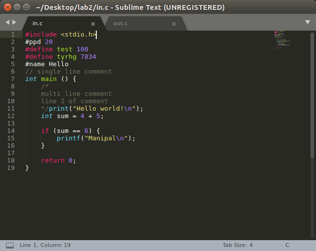
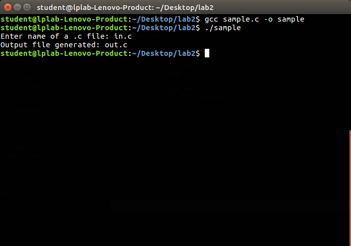
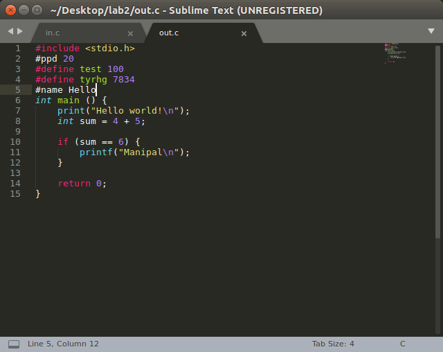
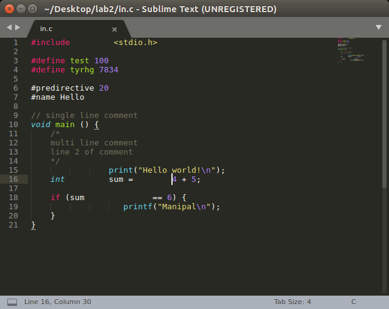
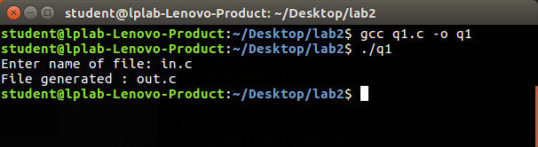
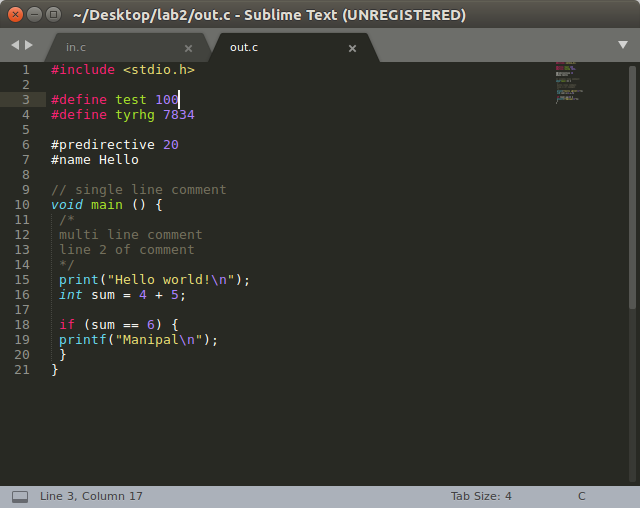

# CD Lab 1
##### Name: Paawan Kohli
##### Reg No: 180905416

### Sample Question: Remove Spaces and Comments

```c
#include <stdio.h>

int main() {
	char filename[30];
	printf("Enter name of a .c file: ");
	scanf("%s", filename);

	FILE* in = fopen(filename, "r");

	if (in == NULL) {
		printf("Cannot open file\n");
		return 0;
	}

	FILE* out = fopen("out.c", "w");

	int c = getc(in);

	while (c != EOF) {

		if (c == ' ') {
			putc(' ', out);

			while (c == ' ') {
				c = getc(in);
			}
		}

		if (c == '/') {
			int cnext = getc(in);

			if (cnext == '/') {

				while (c != '\n') {
					c = getc(in);
				}

			}

			else if (cnext == '*') {
				do {

					while (c != '*') {
						c = getc(in);
					}

					c = getc(in);
				} while (c != '/');
			}

			else {
				putc(c, out);
				putc(cnext, out);
			}
		}

		else {
			putc(c, out);
		}

		c = getc(in);
	}

	fclose(in);
	fclose(out);

	printf("Output file generated: out.c\n");

	return 0;
}
```

##### Input file:



##### Terminal:



##### Output file:


\pagebreak

### Q1 replaces blank spaces and tabs by single space

```c
#include <stdio.h>
#include <stdlib.h>

void main() {
	char filename[30];
	printf("Enter name of file: ");
	scanf("%s", filename);

	FILE* in = fopen(filename, "r");

	if (in == NULL) {
		printf("Can't open file %s.\n", filename);
		exit(0);
	}

	FILE* out = fopen("out.c", "w");

	char c = getc(in);

	while (c != EOF) {

		if (c == '\t' || c == ' ') {
			putc(' ', out);

			while (c == ' ' || c == '\t') {
				c = getc(in);
			}
		}

		else {
			putc(c, out);
			c = getc(in);
		}
	}

	printf("File generated : out.c\n");

	fclose(in);
	fclose(out);
}
```

##### Input file:



##### Terminal:



##### Output file:


\pagebreak

### Q2 ignore preprocessor directives

```c
#include <stdio.h>
#include <stdlib.h>
#include <ctype.h>
#include <string.h>

void main() {
	char filename[30];
	printf("Enter name of file: ");
	scanf("%s", filename);

	FILE* in = fopen(filename, "r");

	if (in == NULL) {
		printf("Can't open file %s.\n", filename);
		exit(0);
	}

	char buffer[100];
	int bufferIndex = 0;
	buffer[bufferIndex] = '\0';

	char c = getc(in);

	while (c != EOF) {

		if (c == '#') {
			buffer[bufferIndex++] = c;
			c = getc(in);

			while (isalpha(c)) {
				buffer[bufferIndex++] = c;
				c = getc(in);
			}

			buffer[bufferIndex] = '\0';

			if (strcmp(buffer, "#define") == 0 || strcmp(buffer, "#include") == 0) {
				while (c != '\n') {
					c = getc(in);
				}
			} else {
				printf("%s", buffer);
				printf("%c", c);
			}

			bufferIndex = 0;
			buffer[bufferIndex] = '\0';
		}

		else {
			printf("%c", c);
		}

		c = getc(in);
	}

	printf("\n");

	fclose(in);
}
```

### Q3 uppercase all keywords

```c
#include <stdio.h>
#include <stdlib.h>
#include <string.h>
#include <ctype.h>

char keyword[32][20] = {"auto", "break", "case", "char", "const", "continue",
                        "default", "do", "double", "else", "enum", "extern",
                        "float", "for", "goto", "if", "int", "long", "register",
                        "return", "short", "signed", "sizeof", "static", "struct",
                        "switch", "typedef", "union", "unsigned", "void",
                        "volatile", "while"
                       };


void main() {
	char filename[30];
	printf("Enter name of file: ");
	scanf("%s", filename);
	printf("\n");

	FILE* in = fopen(filename, "r");

	if (in == NULL) {
		printf("Can't open file %s.\n", filename);
		exit(0);
	}

	char buffer[100] = "";
	int bufferIndex = 0;

	char c = getc(in);

	while (c != EOF) {

		if (c == '\"') {
			// string enclosed in double quotes
			while (c != '\"') {
				printf("%c", c);
				c = getc(in);
			}

			printf("%c", c);
		}

		else if (isalpha(c)) {
			buffer[bufferIndex++] = c;
		}

		else {
			buffer[bufferIndex] = '\0';


			// print uppercase if buffer has a keyword
			for (int i = 0; i < 32 ; i++) {
				if (strcmp(buffer, keyword[i]) == 0) {

					for (int k = 0 ; k < bufferIndex ; k++) {
						printf("%c", toupper(buffer[k]));
					}

					bufferIndex = 0;
					buffer[bufferIndex] = '\0';

					break;
				}
			}

			if (bufferIndex != 0) {
				// buffer didn't have a keyword
				printf("%s", buffer);
				bufferIndex = 0;
				buffer[bufferIndex] = '\0';
			}

			// print pending non alpha character
			printf("%c", c);
		}

		c = getc(in);
	}

	printf("\n");
	fclose(in);
}
```